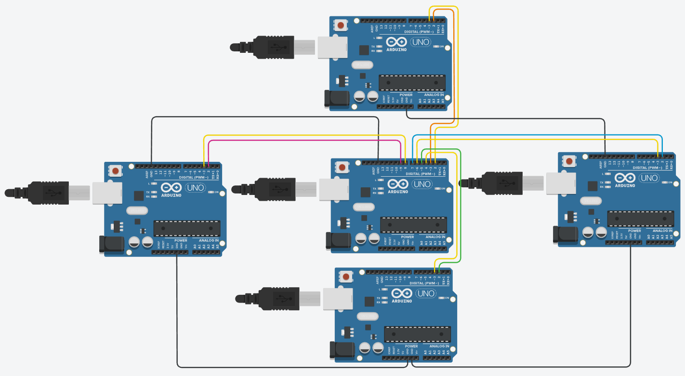
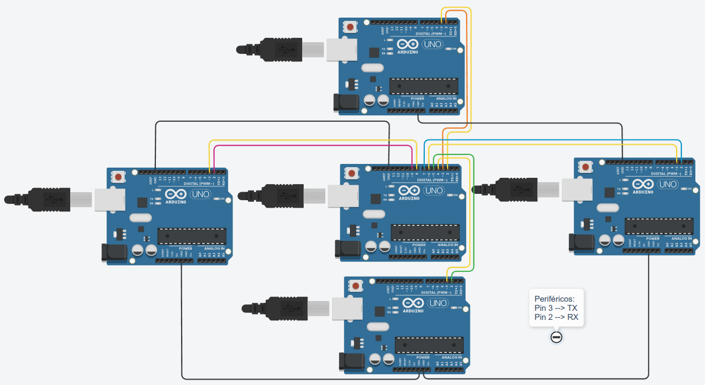
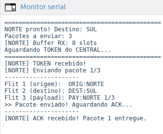
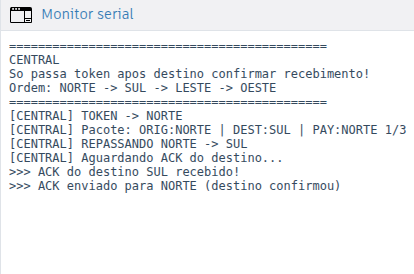
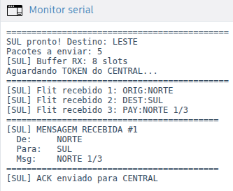

# Arduino UART Token-Based Star Network
### A Deterministic Multi-Node Communication System using SoftwareSerial


<!--  -->
<p align="center">
  
</p>

#### Important Notes

- All comments, docstrings, and runtime messages in the source code are written in Portuguese  
- This project was developed and validated in a simulated environment

---

## Overview

This project implements a **deterministic UART-based communication system** between multiple Arduino nodes using a **token-passing mechanism over a star topology**.

A **central node (ID 0)** coordinates communication between peripheral routers:

* NORTE (NORTH)
* SUL (SOUTH)
* LESTE (EAST)
* OESTE (WEST)

Each router transmits only when it receives a ```TOKEN```, ensuring **collision-free communication**.

All inter-router communication is **mediated by the central node**, meaning no direct router-to-router transmission occurs.

The project demonstrates several core embedded systems and networking concepts:

- Token-based medium access control over UART communication
- Star topology network with a centralized arbitrator
- Flit-based packet structure (ORIG / DEST / PAY)
- ACK-based reliable delivery with timeout and retransmission
- Buffer handling and flushing to prevent residual data corruption
- Multi-channel SoftwareSerial management on a single Arduino

---

## Repository Structure

```text
Arduino_UART_Token-Based_Star_Network/
│
├── images/
│   ├── funcionamento_central.png
│   ├── funcionamento_norte.png
│   ├── funcionamento_sul.png
│   └── topologia_estrela_uart_arduinos.png
|
├── src/
│   ├── uart_central.ino
│   ├── uart_north.ino
│   ├── uart_south.ino
│   ├── uart_east.ino
│   └── uart_west.ino
│
├── License
│
└── README.md
```

---

## How It Works

1. Central sends a ```TOKEN``` to the current node
2. The node replies with a 3-flit packet or ```NADA``` if it has nothing to send
3. Central forwards the packet to the destination node
4. Destination receives the packet and replies with ```ACK```
5. Central forwards the ```ACK``` back to the origin
6. Central advances the ```token``` **only after successful delivery** or when the node reports ```NADA```
7. When all nodes reply ```NADA```, the session ends

### Packet Structure

Each message is split into **3 flits**, sent sequentially over UART:

| Flit | Format         | Description              |
|------|--------------|--------------------------|
| 1    | `ORIG:<name>` | Sender node name         |
| 2    | `DEST:<name>` | Destination node name    |
| 3    | `PAY:<text>`  | Message payload          |

### Control Messages

| Message | Direction          | Meaning                          |
|--------|--------------------|----------------------------------|
| TOKEN  | Central → Node     | Node may now transmit            |
| NADA   | Node → Central     | Node has nothing to send         |
| ACK    | Both directions    | Packet received successfully     |

---

## Example Communication Flow

### NORTE → CENTRAL → SUL

<p align="center">
  
  
  
</p>

<p align="center">
  Message flow from NORTE to SUL through the CENTRAL node.
</p>

### Step-by-step

1. **CENTRAL** sends `TOKEN` to **NORTE**
2. **NORTE** transmits:
  ```
    ORIG:NORTE
    DEST:SUL
    PAY:<message>
  ```
4. **CENTRAL** receives the packet  
5. **CENTRAL** forwards the packet to **SUL**  
6. **SUL** sends `ACK` to **CENTRAL**  
7. **CENTRAL** sends `ACK` back to **NORTE**  
8. **CENTRAL** passes the `TOKEN` to the next router

---

## Reliable Delivery (Timeout + Immediate Retransmission)

If the destination router does not send an ```ACK```:

- CENTRAL detects a ```timeout```
- CENTRAL does not advance the ```token```
- The origin does not receive an ```ACK``` and automatically retransmits the packet within the same token cycle

This guarantees that:

- No packet is lost
- Delivery is confirmed before progressing
- Communication remains deterministic

---

## Wiring

<p align="center">
  
</p>

Each peripheral node uses **one dedicated TX pin** and **one dedicated RX** pin on the Central Arduino via SoftwareSerial.

| Node  | D2 (RX) Connected To | D3 (TX) Connected To |
|-------|----------------------|----------------------|
| NORTH | Central TX (D3)      | Central RX (D2)      |
| SOUTH | Central TX (D5)      | Central RX (D4)      |
| EAST  | Central TX (D7)      | Central RX (D6)      |
| WEST  | Central TX (D9)      | Central RX (D8)      |

> **Note:** Always connect GND between all boards sharing UART lines.

---

## Timing Configuration

All timing constants must be consistent across Central and peripheral nodes.

Configuration Constants:

| Constant                    | Default       | Description                                      |
|----------------------------|--------------|--------------------------------------------------|
| BAUD_RATE                  | 2400         | Serial baud rate                                 |
| DELAY_FLIT                 | 600–800 ms   | Pause between consecutive flits                  |
| TIMEOUT_ACK                | 12000 ms     | Node timeout waiting for ACK from Central        |
| TIMEOUT_ACK_DESTINO        | 8000 ms      | Central timeout waiting for ACK from destination |
| ESPERA_APOS_TOKEN          | 2000 ms      | Central wait after sending TOKEN                 |
| DELAY_APOS_ULTIMO_FLIT     | 1500 ms      | Extra wait after last flit before listening ACK  |

---

## Peripheral Node Configuration

To configure a peripheral node, edit the following section at the top of its ```.ino``` file:

```cpp
const char MEU_NOME[]    = "NORTE";   // This node's name
const char MEU_DESTINO[] = "SUL";   // Valid: SOUTH, EAST, WEST

const char* payloads[] = {
  "Message 1",
  "Message 2",
  "Message 3"
};

int totalPacotes = 3; // Must match the number of entries in payloads[]
```

---

## Features

- Centralized token arbitration in star topology (North -> South -> East -> West -> North)
- Reliable delivery with ACK and automatic retransmission on timeout
- Buffer handling and flushing to prevent residual data corruption
- Flit misalignment detection and automatic reset
- Nodes marked as finished after replying NADA; token skips them
- Session terminates cleanly when all nodes are done
- Per-node serial monitor output for easy debugging

---

## Future Improvements

- Priority-based token scheduling
- Error detection (e.g., CRC)
- Fault tolerance (node failure handling, scalable networks)

---

## License

This project is open-source and available under the GNU General Public License v3.0 (GPLv3).

---

## Additional Notes

Developed as an embedded systems and digital communication project.


